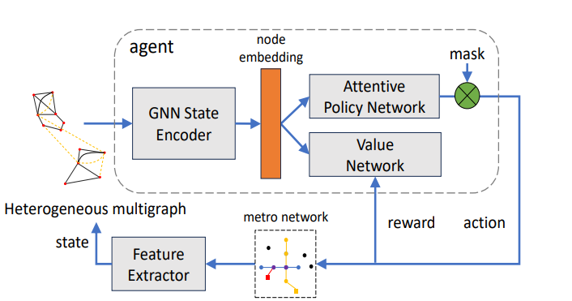
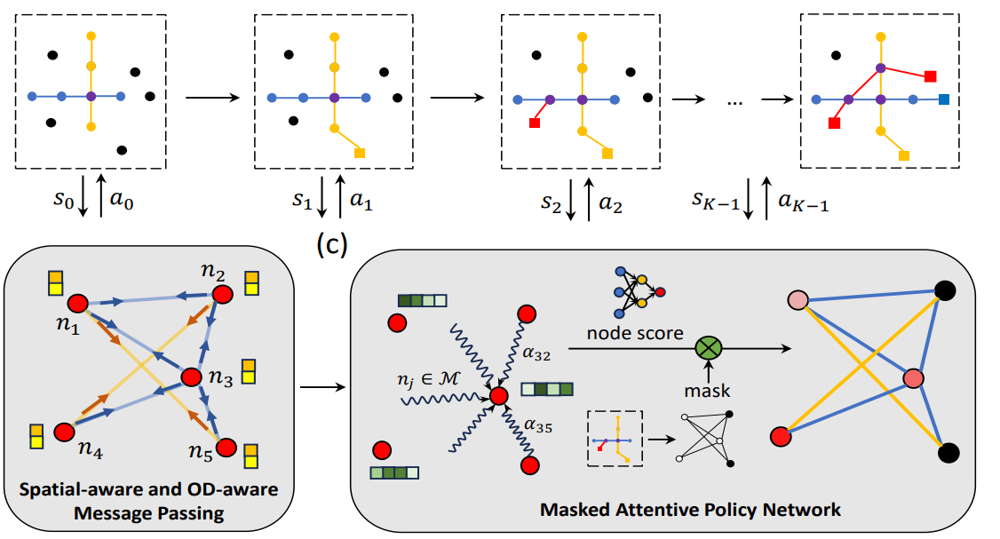
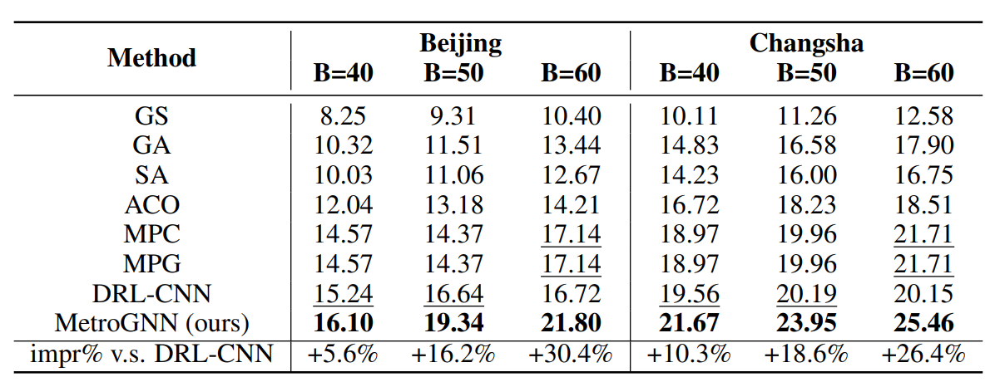
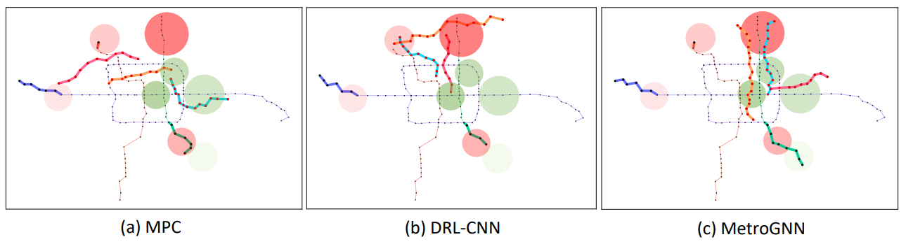

# MetroGNN

### Framework



### Episode




# Installation 

### Environment
* **Tested OS: **Linux
* Python >= 3.8
* PyTorch == 1.10.1
* Tensorboard
### Dependencies:
1. Install [PyTorch 1.10.1](https://pytorch.org/get-started/previous-versions/) with the correct CUDA version.
2. Set the following environment variable to avoid problems with multiprocess trajectory sampling:
    ```
    export OMP_NUM_THREADS=1
    ```

# Training

You can train your own models using the provided config in `metro/cfg`:

```
python -m metro.train --city_name city_name --cfg demo
```
You can replace `demo` to train other cfgs.

The results are saved in `result/city_name/cfg/seed`

### Convergence

Our models MetroGNN, usually converges with less than 100 iterations, which takes about 14 hours on a single server with an Nvidia GeForce 2080Ti GPU.

### Result





- We compared MetroGNN to other baselines at different budgets, with the metrics being OD flow satisfaction.
- If two regions can be connected by a metro network, the product of the OD flow and the transportation efficiency (the ratio of straight-line distance to path distance) between the two regions is considered to be the OD flow satisfaction.


# License
Please see the [license](LICENSE) for further details.

## Note

The implemention is based on *[Transform2Act](https://github.com/Khrylx/Transform2Act)*.
